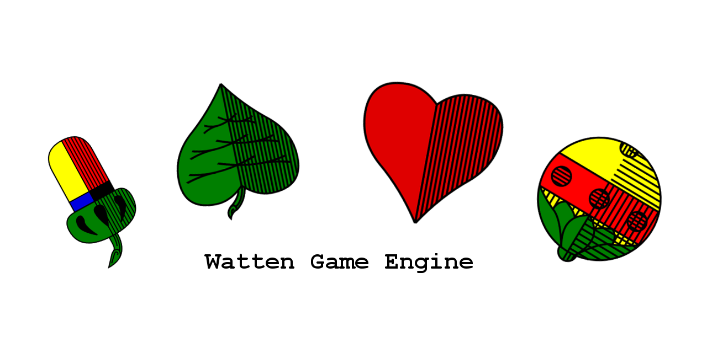

# swatten

Core library for the South Tyrolean variant of the traditional card game [Watten](https://de.wikipedia.org/wiki/Watten), called [Blindwatten](https://de.wikipedia.org/wiki/Watten#Blindwatten).